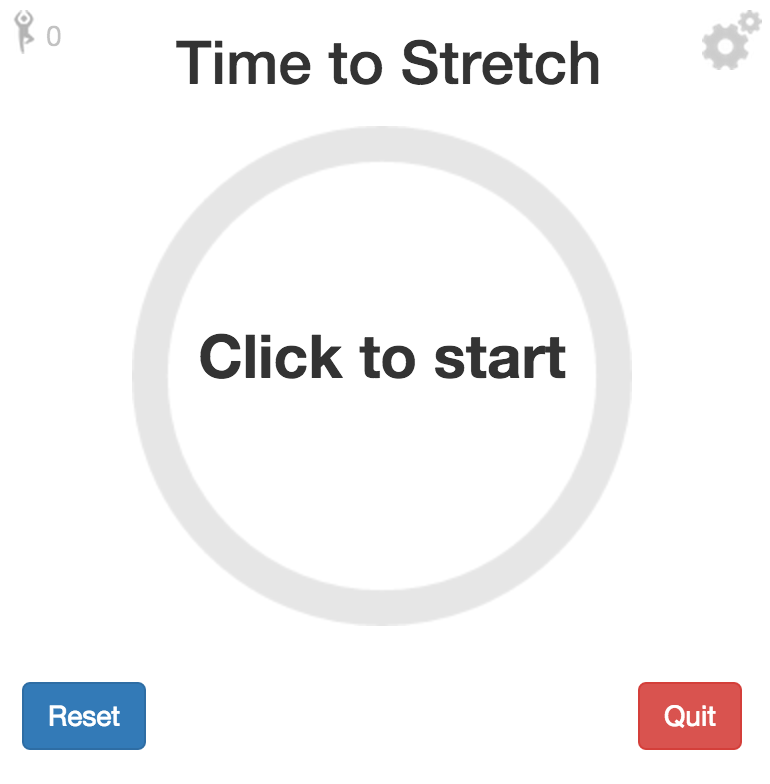

# time-to-stretch

An app to remind you to stretch for Windows and OS X. Heavily based on [the electron Pomodoro](https://github.com/G07cha/pomodoro).



## Features
- Alerts
- Customize work/relax time
- Nice spinner provided by [kottenator](https://github.com/kottenator/jquery-circle-progress)
- Minimalistic design
- Start/stop timer with shortcut(Ctrl + Alt + S)
- Timer in menu bar

## TO-DO
- Examples of the stretches to do on Pop-up
- Fade screen and full-screen when timer up

## Dev

```
npm install -g bower
npm install
bower install
```

### Run

```
npm start
```

## License

MIT © [Peter Souter](http://github.com/petems)

Heavily based on the work by [Konstantin Azizov](http://g07cha.github.io)
